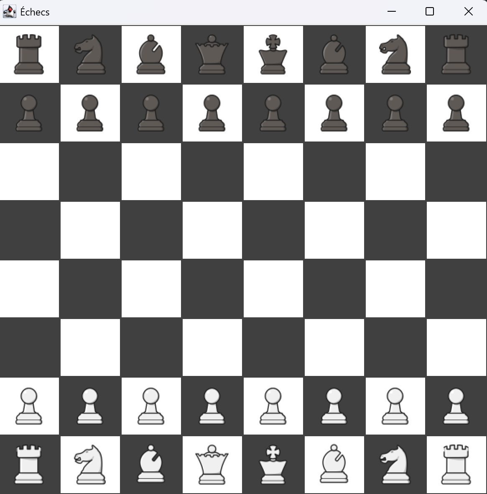
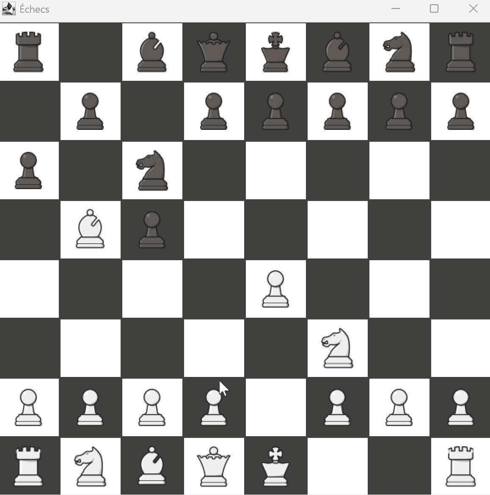

<h1 align="center">Jeu d’échecs – Java Swing (MVC)</h1>

---

## Table des matières
- [Description du projet](#description-du-projet)
- [Technologies utilisées](#technologies-utilisées)
- [Aperçu du jeu](#aperçu-du-jeu)
- [Auteures](#auteures)
- [Progression du projet](#progression-du-projet)

---

## Description du projet

Ce projet consiste à développer un **jeu d’échecs complet** en **Java** avec une interface graphique réalisée en **Swing**, en suivant l’architecture **MVC (Modèle – Vue – Contrôleur)**.

Il a été réalisé dans un **cadre académique** (1ère année) avec pour objectifs :
- appliquer les principes de la **programmation orientée objet**
- séparer clairement la logique métier, l’interface graphique et les interactions utilisateur
- modéliser les règles du jeu d’échecs de manière extensible et maintenable

**Fonctionnalités principales :**
- Plateau d’échecs interactif
- Gestion des déplacements légaux des pièces
- Tour par tour entre deux joueurs
- Détection des captures
- Architecture MVC assurant une bonne séparation des responsabilités

---

## Technologies utilisées

| Technologie | Détails |
|------------|--------|
| **Langage** | Java |
| **Interface graphique** | Java Swing |
| **Outils** | IntelliJ IDEA, Git, GitHub |

---

## Aperçu du jeu

### Interaction utilisateur
- Sélection d’une pièce à la souris
- Mise en surbrillance des coups possibles
- Déplacement et capture visuels

> Interface 2D simple, orientée clarté et lisibilité.

---

## Auteures

- **Nawal El Khal**  
  Étudiante en école d’ingénieur informatique  
  🔗 [GitHub](https://github.com/Nawal-EL-KHAL)  

- **Ashley Padayodi**  
  Étudiante en école d’ingénieur informatique  
  🔗 [GitHub](https://github.com/ednashley) 

---

## Progression du projet

**Statut : Fonctionnel**

### Fonctionnalités implémentées
- Plateau d’échecs et affichage graphique
- Déplacements de base des pièces
- Gestion des tours de jeu
- Détection de l’échec et de l’échec et mat
- Gestion du roque
- Promotion des pions

### Fonctionnalités en cours
- Extension en jeu de dames
- Historique des coups (notation PGN)

### Améliorations possibles
- Mode joueur contre IA
- Mode multijoueur réseau
- Sauvegarde / chargement de partie

👉 Toute suggestion ou contribution est appréciée.
